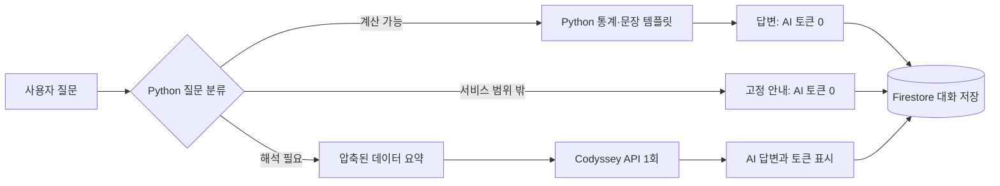

# 내돈비서

취업준비생의 수입과 소비 데이터를 이해하고, 저장된 데이터에 근거한 답변을 제공하는 개인 소비 분석 서비스입니다. 총지출·엥겔지수 같은 계산 질문은 Python이 토큰 없이 답하고, 소비 습관 평가처럼 해석이 필요한 질문만 Codyssey AI를 한 번 호출합니다.

> 모든 거래는 실제 토스 내역이 아닌 과제용 가상 데이터입니다. 개인정보와 실제 상호는 포함하지 않습니다.

## 주요 기능

- Firestore 거래 추가·조회·수정·삭제
- 기간·카테고리 필터와 CSV 내보내기
- 엥겔지수, 주거비 비중, 평균소비성향, 고정비 부담률, 선택소비 비중
- Python `matplotlib` 기반 월별 수입·지출 그래프
- 데이터 요약을 시스템 프롬프트에 주입하는 AI 상담
- 답변별 AI 호출 횟수와 입력·출력·전체 토큰 표시
- 대화 자동 저장, 목록 조회, 상세 불러오기, 삭제
- 프롬프트 인젝션과 서비스 범위 밖 질문의 로컬 차단
- 콜드 스타트 안내와 서버 깨우기
- 반응형 화면과 다크 모드

## 기술 스택

| 영역 | 기술 |
|---|---|
| 백엔드 | Python 3.12, FastAPI, Pydantic, Uvicorn |
| 데이터베이스 | Firebase Firestore |
| AI | Codyssey OpenAI 호환 API, `gpt-5.4-mini` |
| 분석·그래프 | Python 표준 라이브러리, Matplotlib |
| 토큰 측정 | API `usage`, tiktoken 대체 측정 |
| 프론트엔드 | HTML, CSS, JavaScript |
| 배포 | Render, Vercel |

## 데이터

`data/jobseeker_spending_2026-06_to_2026-08.csv`에는 2026년 6월 1일부터 8월 31일까지 정확히 180건이 들어 있습니다. 각 달은 수입 2건과 소비 58건으로 구성됩니다.

| 필드 | 설명 |
|---|---|
| `date` | 거래일 |
| `value` | 원 단위 양의 금액 |
| `memo` | 익명화된 거래 설명 |
| `type` | `income` 또는 `expense` |
| `category` | 수입·소비 카테고리 |
| `is_fixed` | 고정비 여부 |
| `is_essential` | 필수소비 여부 |

## 처리 흐름과 토큰 절약



원본 거래 전체를 AI에 보내지 않습니다. 기간, 합계, 비율, 상위 카테고리와 월별 변화만 압축해 시스템 프롬프트에 넣습니다. 최근 대화도 최대 4개 메시지만 전송하고, 답변은 2문장·250자 이내로 요청합니다.

시스템 지침의 무시·변경·공개를 요구하는 대표적인 프롬프트 인젝션 패턴은 Python에서 먼저 검사합니다. 의심 요청은 AI를 호출하지 않고 안전 안내를 반환하며, 정상 요청에도 시스템 지침과 역할을 변경하지 말라는 규칙을 함께 적용합니다. 개인 소비·수입·예산 데이터와 무관한 질문도 Python 규칙으로 차단하고 고정 안내를 반환하므로 AI 토큰을 사용하지 않습니다.

## 프로젝트 구조

```text
naedon-assistant/
├── backend/
│   ├── app/
│   │   ├── repositories/   # Firestore와 테스트 저장소
│   │   ├── routers/        # 데이터·대화·채팅 API
│   │   └── services/       # 통계·로컬 답변·AI·그래프
│   ├── scripts/            # Firestore CSV 적재
│   └── tests/
├── frontend/
│   ├── src/
│   └── build.sh
├── data/
└── render.yaml
```

## 환경 변수

| 변수 | 위치 | 설명 |
|---|---|---|
| `FIREBASE_SERVICE_ACCOUNT_JSON` | 백엔드 | 서비스 계정 JSON 전체 문자열 또는 로컬 파일 경로 |
| `CODYSSEY_API_KEY` | 백엔드 | Codyssey에서 발급한 OpenAI 호환 키 |
| `CODYSSEY_BASE_URL` | 백엔드 | 기본값 `https://copa.codyssey.kr/v1` |
| `CODYSSEY_MODEL` | 백엔드 | 기본값 `gpt-5.4-mini` |
| `MAX_AI_OUTPUT_TOKENS` | 백엔드 | 추론 토큰을 포함한 출력 상한, 기본값 `500` |
| `ALLOWED_ORIGINS` | 백엔드 | 쉼표로 구분한 프론트 주소 |
| `API_BASE_URL` | 프론트 빌드 | Render 백엔드 주소 |

서비스 계정 키와 API 키를 저장소에 커밋하지 마세요. `.env.example`을 복사해 로컬 `.env`를 만듭니다.

## 로컬 실행

Python 3.10 이상이 필요합니다.

```bash
cd backend
python -m venv .venv
source .venv/bin/activate
pip install -r requirements-dev.txt
cp ../.env.example .env
uvicorn app.main:app --reload
```

다른 터미널에서 프론트를 실행합니다.

```bash
cd frontend/src
python -m http.server 5173
```

- 프론트: `http://localhost:5173`
- 백엔드: `http://localhost:8000`
- Swagger: `http://localhost:8000/docs`

실제 Firestore 없이 화면과 API 구조를 확인할 때는 백엔드 `.env`의 `DATA_BACKEND=memory`를 사용할 수 있습니다. 이 모드에서는 가상 CSV 180건을 자동으로 불러오며, 추가·수정한 내용과 대화는 서버를 재시작하면 사라집니다.

## Firestore 준비와 CSV 적재

1. Firebase 프로젝트에서 Firestore Database를 생성합니다.
2. 프로젝트 설정 → 서비스 계정에서 비공개 키 JSON을 발급합니다.
3. JSON 전체를 한 줄 문자열로 `FIREBASE_SERVICE_ACCOUNT_JSON`에 등록합니다.
4. 백엔드 가상환경에서 적재 스크립트를 실행합니다.

```bash
cd backend
python scripts/seed_firestore.py ../data/jobseeker_spending_2026-06_to_2026-08.csv
```

각 거래의 내용으로 고정 문서 ID를 만들기 때문에 같은 CSV를 다시 적재해도 중복 문서가 생기지 않습니다.

## API

| 메서드 | 경로 | 기능 |
|---|---|---|
| `POST` | `/api/data` | 거래 추가 |
| `GET` | `/api/data` | 거래 목록 및 필터 |
| `PUT` | `/api/data/{id}` | 거래 수정 |
| `DELETE` | `/api/data/{id}` | 거래 삭제 |
| `GET` | `/api/data/summary` | AI 주입용 압축 요약 |
| `GET` | `/api/data/statistics` | 전체 소비 지표 |
| `GET` | `/api/data/export.csv` | 필터 결과 CSV 다운로드 |
| `GET` | `/api/data/charts/monthly-cashflow.png` | Python PNG 그래프 |
| `POST` | `/api/chat` | 로컬 계산 또는 AI 답변 및 자동 저장 |
| `POST` | `/api/conversations` | 대화 직접 저장 |
| `GET` | `/api/conversations` | 메시지를 포함한 대화 목록 |
| `GET` | `/api/conversations/{id}` | 특정 대화 불러오기 |
| `DELETE` | `/api/conversations/{id}` | 대화 삭제 |

### 채팅 응답과 토큰

```json
{
  "answer": "2026년 7월 총지출은 1,271,200원입니다.",
  "conversation_id": "...",
  "source": "local",
  "token_usage": {
    "ai_calls": 0,
    "prompt_tokens": 0,
    "completion_tokens": 0,
    "total_tokens": 0,
    "measurement": "not_used"
  }
}
```

`measurement` 값은 `not_used`, `provider`, `estimated`, `unavailable` 중 하나입니다. API가 `usage`를 반환하면 그 값을 사용하고, 없으면 `tiktoken`으로 추정합니다. 화면의 수치는 성공한 현재 대화에서 API가 보고한 원본 토큰 합계입니다. Codyssey 콘솔의 `차감 토큰`은 모델별 가중치를 적용하므로 이 값과 다를 수 있으며, 실패한 호출이나 다른 클라이언트의 호출도 현재 대화 합계에는 포함되지 않습니다.

## 테스트

```bash
cd backend
pytest
```

테스트는 메모리 저장소와 동일한 CSV 180건을 사용하므로 Firebase와 Codyssey 키가 필요하지 않습니다. CRUD, 통계 기준값, PNG 그래프, CSV 다운로드, 로컬 채팅의 토큰 0을 검증합니다.

## 구현 중 문제와 해결

| 문제 | 원인 | 해결 |
|---|---|---|
| Vercel에서 데이터와 채팅 요청이 `Failed to fetch`로 실패 | Render CORS 허용 목록에 실제 Vercel 출처가 없음 | `ALLOWED_ORIGINS`에 `https://naedon-assistant.vercel.app`을 등록하고 재배포 |
| 무료 서버의 첫 요청이 오래 걸림 | Render 무료 인스턴스의 콜드 스타트 | 서버 깨우기 버튼과 준비 상태 안내 적용 |
| 그래프가 `불러오지 못했습니다`로 표시 | 빈 카테고리 값 `category=`가 전달되어 FastAPI 검증에서 422 반환 | 빈 필터 제외, 그래프 최대 2회 재시도 적용 |
| AI가 출력 토큰을 사용하고도 빈 답변 반환 | `gpt-5-mini`가 300토큰 상한을 내부 처리에 모두 사용 | `gpt-5.4-mini`, 500토큰 상한, 2문장·250자 답변 제한 적용 |
| 대시보드 종료일 이후의 새 거래가 거래 목록에서도 숨겨짐 | 대시보드 필터 상태를 거래 목록 API에도 공유 | 대시보드 필터와 전체 거래 목록을 분리하고 종료일 기본값을 오늘로 설정 |
| 동적 데이터 표시에서 HTML 문자열 생성 사용 | HTML 문자열 조합은 잘못 사용할 경우 스크립트 삽입 위험이 있음 | DOM API와 `textContent`만 사용하도록 렌더링 전환 |
| 같은 조건의 그래프를 반복 생성 | 모든 화면 갱신마다 Matplotlib 실행 | 월별 합계와 테마를 키로 최대 32개 PNG를 메모리 캐시하고 브라우저 캐시 5분 적용 |

## Render 배포

1. 이 저장소를 GitHub에 푸시합니다.
2. Render에서 Blueprint를 만들고 루트의 `render.yaml`을 선택합니다.
3. `CODYSSEY_API_KEY`, `FIREBASE_SERVICE_ACCOUNT_JSON`, `ALLOWED_ORIGINS`를 등록합니다.
4. 배포 후 `/health`와 `/docs`에 접속합니다.

무료 인스턴스는 쉬고 있던 서버의 첫 요청에 시간이 걸릴 수 있습니다. 프론트는 3초 이상 지연되면 안내 문구를 표시하며, `서버 깨우기` 버튼으로 `/health`를 호출한 뒤 현재 화면의 데이터를 다시 불러올 수 있습니다. 그래프는 AI 없이 Python으로 만들며, 동일한 월별 합계와 테마는 캐시된 PNG를 재사용합니다.

## Vercel 배포

1. Vercel에서 같은 저장소를 가져옵니다.
2. Root Directory를 `frontend`로 선택합니다.
3. 환경 변수 `API_BASE_URL`에 Render 주소를 등록합니다.
4. 배포된 Vercel 주소를 Render의 `ALLOWED_ORIGINS`에 추가한 뒤 Render를 다시 배포합니다.

## 배포 URL

- 프론트: https://naedon-assistant.vercel.app
- 백엔드 API: https://naedon-assistant-api.onrender.com
- Swagger: https://naedon-assistant-api.onrender.com/docs

## 제출 스크린샷

README와 제출물에 다음 화면을 첨부합니다.

1. 데이터 요약과 질문·답변이 함께 보이는 채팅 화면
2. 추가 또는 수정된 거래가 보이는 거래 관리 화면
3. 이전 대화를 선택해 불러온 화면
4. 월별 수입·지출 그래프와 추가 소비 지표
5. Render Swagger UI
