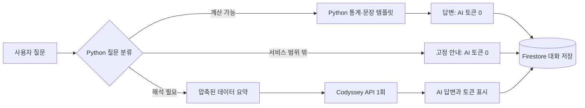
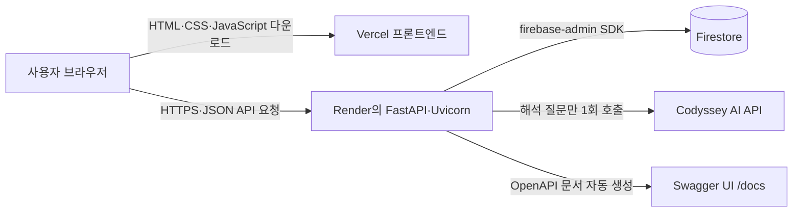
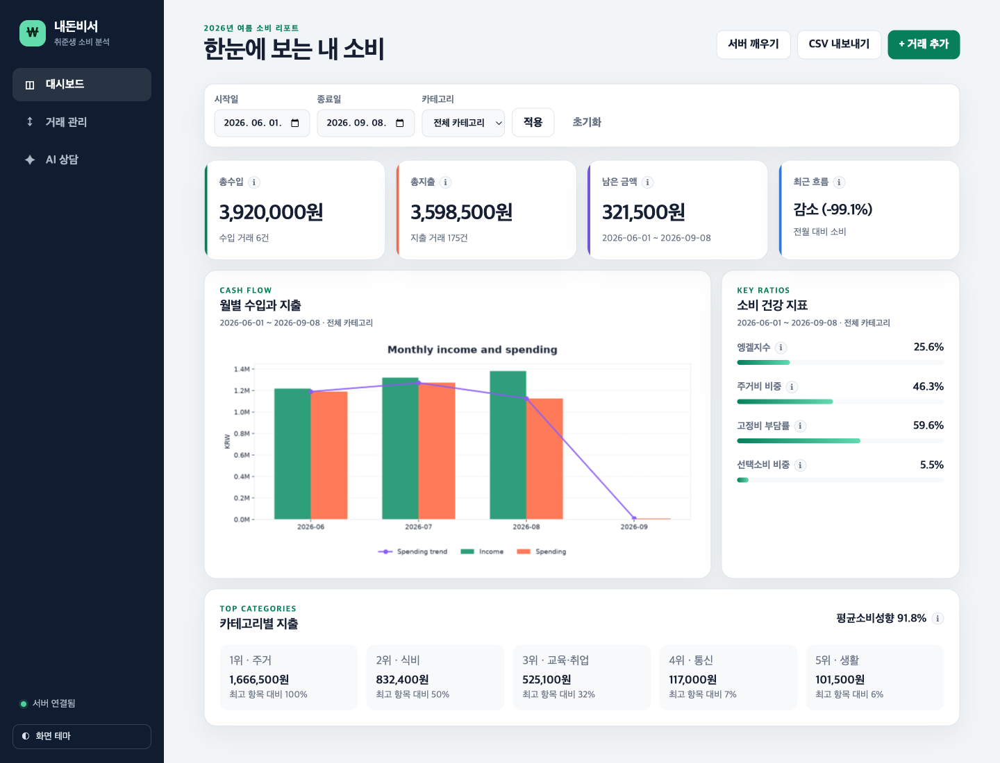
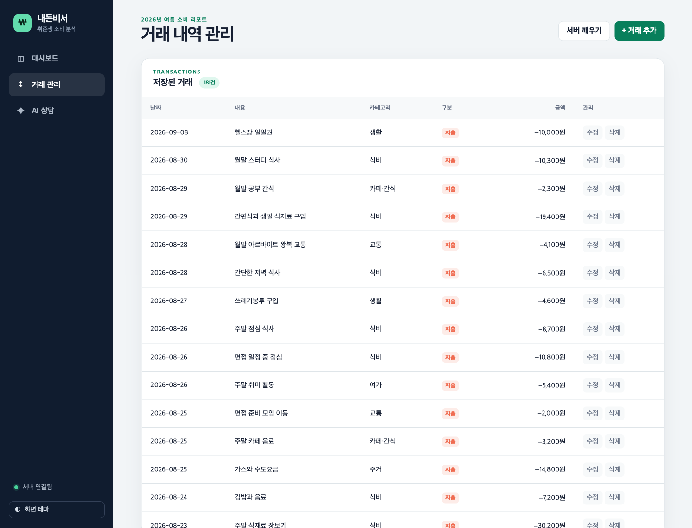
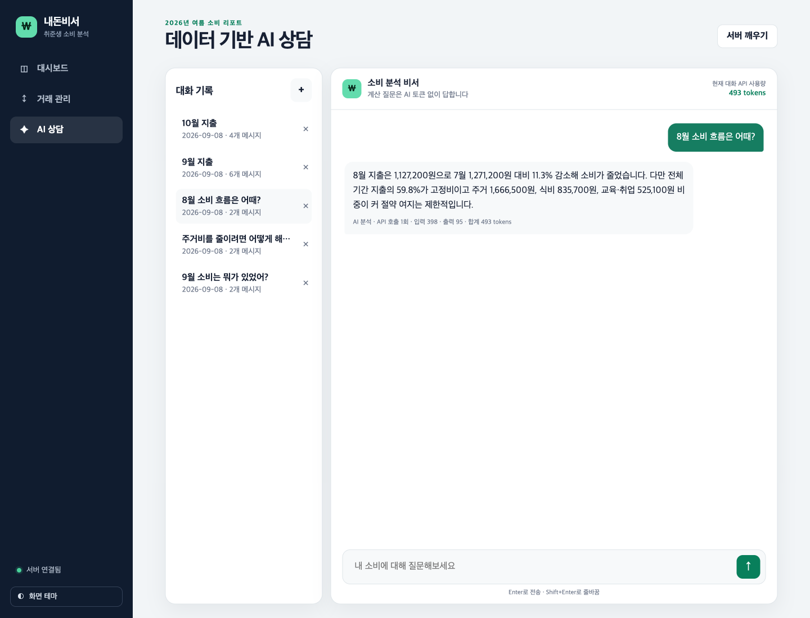
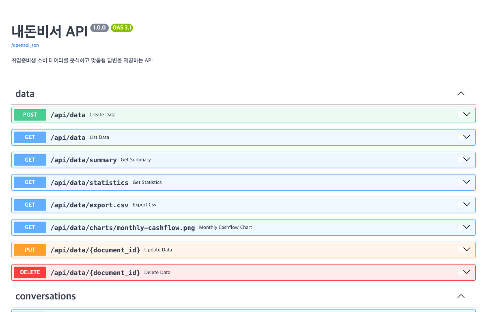

# 내돈비서

취업준비생의 수입과 소비 데이터를 이해하고, 저장된 데이터에 근거한 답변을 제공하는 개인 소비 분석 서비스입니다. 총지출·엥겔지수 같은 계산 질문은 Python이 토큰 없이 답하고, 소비 습관 평가처럼 해석이 필요한 질문만 Codyssey AI를 한 번 호출합니다.

> 모든 거래는 실제 토스 내역이 아닌 과제용 가상 데이터입니다. 개인정보와 실제 상호는 포함하지 않습니다.

## 주요 기능

- Firestore 거래 추가·조회·수정·삭제
- 기간·카테고리 필터와 CSV 내보내기
- 엥겔지수, 주거비 비중, 평균소비성향, 고정비 부담률, 선택소비 비중
- Python `matplotlib` 기반 월별 수입·지출 그래프
- 데이터 요약을 시스템 프롬프트에 주입하는 AI 상담
- 답변별 AI 호출 횟수와 입력·출력·전체 토큰 표시
- 대화 자동 저장, 목록 조회, 상세 불러오기, 삭제
- 프롬프트 인젝션과 서비스 범위 밖 질문의 로컬 차단
- 콜드 스타트 안내와 서버 깨우기
- 반응형 화면과 다크 모드

## 기술 스택

| 영역 | 기술 |
|---|---|
| 백엔드 | Python 3.12, FastAPI, Pydantic, Uvicorn |
| 데이터베이스 | Firebase Firestore |
| AI | Codyssey OpenAI 호환 API, `gpt-5.4-mini` |
| 분석·그래프 | Python 표준 라이브러리, Matplotlib |
| 토큰 측정 | API `usage`, tiktoken 대체 측정 |
| 프론트엔드 | HTML, CSS, JavaScript |
| 배포 | Render, Vercel |

## 데이터

`data/jobseeker_spending_2026-06_to_2026-08.csv`에는 2026년 6월 1일부터 8월 31일까지 정확히 180건이 들어 있습니다. 각 달은 수입 2건과 소비 58건으로 구성됩니다.

| 필드 | 설명 |
|---|---|
| `date` | 거래일 |
| `value` | 원 단위 양의 금액 |
| `memo` | 익명화된 거래 설명 |
| `type` | `income` 또는 `expense` |
| `category` | 수입·소비 카테고리 |
| `is_fixed` | 고정비 여부 |
| `is_essential` | 필수소비 여부 |

## 처리 흐름과 토큰 절약



원본 거래 전체를 AI에 보내지 않습니다. 기간, 합계, 비율, 상위 카테고리와 월별 변화만 압축해 시스템 프롬프트에 넣습니다. 최근 대화도 최대 4개 메시지만 전송하고, 답변은 2문장·250자 이내로 요청합니다.

시스템 지침의 무시·변경·공개를 요구하는 대표적인 프롬프트 인젝션 패턴은 Python에서 먼저 검사합니다. 의심 요청은 AI를 호출하지 않고 안전 안내를 반환하며, 정상 요청에도 시스템 지침과 역할을 변경하지 말라는 규칙을 함께 적용합니다. 개인 소비·수입·예산 데이터와 무관한 질문도 Python 규칙으로 차단하고 고정 안내를 반환하므로 AI 토큰을 사용하지 않습니다.

## 프로젝트 개념 정리

### 전체 서비스의 관계



- **Vercel**은 사용자가 보는 정적 프론트엔드 파일을 빌드하고 배포한다. 브라우저에서 실행된 JavaScript가 Render API를 호출한다.
- **Render**는 FastAPI 백엔드 프로세스를 실행한다. 데이터 검증·통계·질문 분류·AI 호출·Firestore 접근은 여기서 처리한다.
- **Firestore**는 거래와 대화 기록을 영구 저장한다. Render가 재시작돼도 데이터는 유지된다.
- **Swagger UI**는 별도 서버가 아니라 FastAPI가 OpenAPI 명세로 자동 생성하는 API 시험 화면이다. Render 주소의 `/docs`에서 확인한다.

`render.yaml`은 Render 배포 설정을 코드로 기록한 파일이다. 이 프로젝트에서는 Python 버전, `backend` 루트 폴더, 패키지 설치 명령, Uvicorn 실행 명령, 싱가포르 리전, `/health` 상태 확인 경로와 필요한 환경 변수 이름을 정의한다. `sync: false`인 API 키와 Firebase 키의 실제 값은 파일에 넣지 않고 Render 대시보드에서 등록한다.

### Firebase와 Firestore

**Firebase**는 Google이 제공하는 앱 개발 플랫폼 전체를 뜻한다. 인증, 데이터베이스, 호스팅 등 여러 제품을 포함한다. **Cloud Firestore**는 그중 문서 형태로 데이터를 저장하는 관리형 NoSQL 데이터베이스다. 이 프로젝트는 Firebase 전체 기능 중 Firestore를 사용하며, `data` 컬렉션에는 거래를, `conversations` 컬렉션에는 대화와 메시지를 저장한다.

Render와 Firebase는 서로 대신 선택한 서비스가 아니다.

| 서비스 | 이 프로젝트의 역할 | 저장하거나 실행하는 것 |
|---|---|---|
| Render | 백엔드 실행 환경 | FastAPI·Uvicorn Python 프로세스 |
| Firebase | Google의 앱 개발 플랫폼 | Firestore 등 여러 제품을 묶어 제공 |
| Firestore | Firebase에서 사용하는 데이터베이스 | 거래 문서와 대화 문서 |

Firebase가 무료로 사용할 수 없어서 Render를 선택한 것은 아니다. 과제 조건이 **백엔드는 Render, 데이터베이스는 Firestore**로 지정되어 있어 두 서비스를 함께 사용했다. Firestore에는 [무료 사용량](https://firebase.google.com/docs/firestore/quotas)이 있어 현재 학습용 데이터 규모에서는 무료 범위로 사용할 수 있다. Firebase의 Cloud Functions로 백엔드를 만드는 방법도 있지만, 함수 배포에는 [Blaze 요금제와 결제 계정이 필요](https://firebase.google.com/docs/functions/get-started)하고 이번 과제의 Render 배포 조건에도 맞지 않는다.

Firestore는 서버 설치·패치·백업 장비를 직접 운영하지 않아도 되는 관리형 서비스다. 이런 실행 방식을 넓은 의미에서 **서버리스**라고 한다. 서버리스는 서버가 없다는 뜻이 아니라 사용자가 서버 운영을 직접 관리하지 않는다는 뜻이다. Vercel의 정적 배포와 Firestore는 서버리스 성격이 강하지만, 이 프로젝트의 Render 백엔드는 Uvicorn 프로세스를 계속 실행하는 관리형 웹 서비스이므로 엄밀히는 일반적인 함수형 서버리스와 다르다.

무료 Render 인스턴스는 일정 시간 요청이 없으면 잠들 수 있다. 다음 요청에서 실행 환경과 앱을 다시 시작하는 시간이 **콜드 스타트**다. 이때 첫 응답이 수십 초 늦어질 수 있어 화면은 3초 이상 지연되면 안내를 표시한다. `서버 깨우기` 버튼은 `/health`를 호출하고, 준비가 끝나면 현재 화면의 데이터를 다시 불러온다.

### API와 HTTP 메서드

**API(Application Programming Interface)**는 한 소프트웨어가 다른 소프트웨어의 기능을 정해진 형식으로 사용하는 약속이다. 라이브러리의 함수도 API가 될 수 있다. **웹 API**는 이 약속을 URL, HTTP 메서드, 요청·응답 본문(JSON 등)으로 제공한다. 내돈비서 프론트엔드는 Render의 웹 API를 사용한다.

**HTTP 메서드**는 클라이언트가 서버에 보내는 요청의 목적을 나타낸다. 같은 URL이라도 메서드에 따라 조회, 생성, 수정, 삭제처럼 서로 다른 동작을 수행할 수 있다. `GET`은 데이터 조회, `POST`는 새 데이터 생성, `PUT`은 기존 데이터 수정, `DELETE`는 데이터 삭제에 주로 사용한다. CRUD와의 관계는 다음과 같다.

| CRUD | 의미 | 주로 사용하는 HTTP 메서드 | 이 프로젝트의 예 |
|---|---|---|---|
| Create | 새 데이터 생성 | `POST` | `POST /api/data` |
| Read | 데이터 조회 | `GET` | `GET /api/data` |
| Update | 기존 데이터 전체 수정 | `PUT` | `PUT /api/data/{id}` |
| Delete | 데이터 삭제 | `DELETE` | `DELETE /api/data/{id}` |

`GET /health`는 서버가 요청에 응답할 수 있는지와 현재 데이터 저장 방식이 무엇인지 확인하는 가벼운 상태 확인 API다. Render도 이 경로로 배포 상태를 검사하고, 프론트의 서버 상태 표시와 깨우기 버튼도 이 API를 사용한다. 데이터나 AI를 조회하지 않으므로 확인 비용이 작다.

### FastAPI, Uvicorn, Pydantic

**FastAPI**는 Python으로 웹 API를 만드는 프레임워크다. URL과 HTTP 메서드를 Python 함수에 연결하고, JSON 변환, 오류 응답, OpenAPI 문서와 Swagger UI 생성을 지원한다. 이 프로젝트는 통계 코드와 같은 Python 생태계를 사용할 수 있고, 비동기 AI 호출을 처리하며, Pydantic 검증과 `/docs` 문서를 적은 코드로 제공할 수 있어 FastAPI를 선택했다. 라우터는 데이터·대화·채팅 기능으로 나누고 계산과 외부 API 호출은 서비스 함수로 분리했다.

FastAPI 자체는 네트워크 포트를 열어 요청을 받지 않는다. **Uvicorn**이 ASGI 서버로서 HTTP 연결을 받고 FastAPI 앱에 요청을 전달한 뒤 응답을 브라우저로 보낸다. Render의 실행 명령도 `uvicorn app.main:app --host 0.0.0.0 --port $PORT`이다.

**Pydantic**은 Python 타입 선언을 기준으로 요청 데이터를 검사하고 변환하는 라이브러리다. 거래 날짜가 날짜 형식인지, 금액이 양수인지, 메모가 비어 있지 않은지, `type`과 `category` 조합이 맞는지 검사한다. 잘못된 입력은 저장 전에 FastAPI의 `422` 응답으로 거부되므로 Firestore 데이터 형식을 일정하게 유지할 수 있다.

### CORS

**CORS(Cross-Origin Resource Sharing)**는 브라우저가 다른 출처의 서버를 호출해도 되는지 결정하는 규칙이다. 출처는 프로토콜·도메인·포트의 조합이다. 따라서 `https://naedon-assistant.vercel.app`과 `https://naedon-assistant-api.onrender.com`은 서로 다른 출처다.

초기 배포에서는 Render 응답에 Vercel 출처를 허용하는 헤더가 없어 브라우저의 사전 요청(`OPTIONS`, preflight)이 차단됐고 화면에 `Failed to fetch`가 표시됐다. Render의 `ALLOWED_ORIGINS`에 실제 Vercel 주소를 넣고 FastAPI `CORSMiddleware`가 `Access-Control-Allow-Origin` 헤더를 반환하도록 해결했다. CORS는 브라우저의 접근 통제이며 사용자 로그인이나 API 인증을 대신하지 않는다.

### 질문 분류와 AI 처리

`POST /api/chat`은 다음 순서로 질문을 처리한다.

1. 시스템 지침 무시·역할 변경·프롬프트 공개 같은 인젝션 패턴이면 고정 보안 안내를 반환한다.
2. 소비·지출·수입·예산·저축·생활비·거래·소비 지표 등의 관련 단어가 없으면 서비스 범위 안내를 반환한다. 월 표현과 분석 표현의 조합, 직전 소비 대화를 잇는 짧은 후속 질문은 관련 질문으로 인정한다.
3. 관련 질문 중 Python으로 계산 가능한 질문이면 Firestore 데이터를 집계하고 문장 템플릿으로 답한다.
4. 평가·조언처럼 해석이 필요한 질문만 압축 요약과 최근 메시지를 Codyssey API에 보내 답을 생성한다.
5. 어느 경로든 질문과 답변, 처리 방식, 토큰 정보를 `conversations`에 저장한다.

범위 판정은 AI를 호출하는 의미 분석이 아니라 `guardrails.py`의 정규식과 관련 단어 목록을 사용하는 로컬 규칙이다. 따라서 토큰을 쓰지 않고 빠르지만 새로운 표현은 목록을 보완해야 할 수 있다. 예를 들어 “오늘 날씨를 알려줘”는 고정 안내와 0토큰을 반환하고, “8월 소비 흐름은 어때?”는 소비 분석 질문으로 통과한다.

Python이 직접 답할 수 있는 질문은 다음과 같다.

| 질문 종류 | 계산 또는 조회 내용 |
|---|---|
| 총수입·총지출·잔액 | 수입 합계, 지출 합계, 두 값의 차이 |
| 엥겔지수 | `(식비 + 카페·간식) / 총지출 × 100` |
| 평균소비성향 | `총지출 / 총수입 × 100` |
| 주거비·고정비·선택소비 | 각 금액과 총지출 대비 비율 |
| 평균 지출·거래 건수 | 지출 거래 평균, 수입·지출 건수 |
| 가장 큰 카테고리 | 카테고리별 지출 합계의 1위 |
| 데이터 기간·특정 월 | 저장된 기간 또는 질문에 포함된 월의 통계 |

질문에 `왜`, `평가`, `조언`, `개선`, `추천`, `계획`, `습관`, `분석`, `줄이기`, `어떻게`처럼 해석이 필요한 표현이 있으면 AI 경로로 보낸다. 이때 원본 거래 180여 건은 보내지 않고 기간·건수·수입·지출·잔액·핵심 비율·추세·상위 카테고리 5개·월별 수입과 지출만 JSON으로 압축한다. 여기에 최근 대화 최대 4개 메시지와 현재 질문을 더해 시스템 프롬프트로 전달한다. 답변은 2문장·250자 이내, 출력 상한 500토큰으로 요청하며 호출은 최대 1회다.

### venv

**venv**는 프로젝트 전용 Python 가상환경이다. FastAPI, Firebase Admin, Matplotlib 같은 패키지를 운영체제의 전역 Python과 분리해 설치한다. 프로젝트마다 서로 다른 패키지 버전을 사용해도 충돌하지 않고, `requirements.txt`로 배포 환경과 같은 의존성을 재현하기 쉬워진다. `source .venv/bin/activate`를 실행하면 현재 터미널의 `python`과 `pip`가 저장소의 `.venv`를 가리킨다. `.venv`는 다시 만들 수 있으므로 Git에는 올리지 않는다.

## 프로젝트 구조

```text
naedon-assistant/
├── backend/
│   ├── app/
│   │   ├── repositories/   # Firestore와 테스트 저장소
│   │   ├── routers/        # 데이터·대화·채팅 API
│   │   └── services/       # 통계·로컬 답변·AI·그래프
│   ├── scripts/            # Firestore CSV 적재
│   └── tests/
├── frontend/
│   ├── src/
│   └── build.sh
├── data/
└── render.yaml
```

## 환경 변수

| 변수 | 위치 | 설명 |
|---|---|---|
| `FIREBASE_SERVICE_ACCOUNT_JSON` | 백엔드 | 서비스 계정 JSON 전체 문자열 또는 로컬 파일 경로 |
| `CODYSSEY_API_KEY` | 백엔드 | Codyssey에서 발급한 OpenAI 호환 키 |
| `CODYSSEY_BASE_URL` | 백엔드 | 기본값 `https://copa.codyssey.kr/v1` |
| `CODYSSEY_MODEL` | 백엔드 | 기본값 `gpt-5.4-mini` |
| `MAX_AI_OUTPUT_TOKENS` | 백엔드 | 추론 토큰을 포함한 출력 상한, 기본값 `500` |
| `ALLOWED_ORIGINS` | 백엔드 | 쉼표로 구분한 프론트 주소 |
| `API_BASE_URL` | 프론트 빌드 | Render 백엔드 주소 |

서비스 계정 키와 API 키를 저장소에 커밋하지 마세요. `.env.example`을 복사해 로컬 `.env`를 만듭니다.

## 로컬 실행

Python 3.10 이상이 필요합니다.

```bash
cd naedon-assistant
python3 -m venv .venv
source .venv/bin/activate
pip install -r backend/requirements-dev.txt
cp .env.example backend/.env
cd backend
uvicorn app.main:app --reload
```

다른 터미널에서 프론트를 실행합니다.

```bash
cd frontend/src
python -m http.server 5173
```

- 프론트: `http://localhost:5173`
- 백엔드: `http://localhost:8000`
- Swagger: `http://localhost:8000/docs`

실제 Firestore 없이 화면과 API 구조를 확인할 때는 백엔드 `.env`의 `DATA_BACKEND=memory`를 사용할 수 있습니다. 이 모드에서는 가상 CSV 180건을 자동으로 불러오며, 추가·수정한 내용과 대화는 서버를 재시작하면 사라집니다.

## Firestore 준비와 CSV 적재

1. Firebase 프로젝트에서 Firestore Database를 생성합니다.
2. 프로젝트 설정 → 서비스 계정에서 비공개 키 JSON을 발급합니다.
3. JSON 전체를 한 줄 문자열로 `FIREBASE_SERVICE_ACCOUNT_JSON`에 등록합니다.
4. 백엔드 가상환경에서 적재 스크립트를 실행합니다.

```bash
cd backend
python scripts/seed_firestore.py ../data/jobseeker_spending_2026-06_to_2026-08.csv
```

각 거래의 내용으로 고정 문서 ID를 만들기 때문에 같은 CSV를 다시 적재해도 중복 문서가 생기지 않습니다.

## API

| 메서드 | 경로 | 기능 |
|---|---|---|
| `POST` | `/api/data` | 거래 추가 |
| `GET` | `/api/data` | 거래 목록 및 필터 |
| `PUT` | `/api/data/{id}` | 거래 수정 |
| `DELETE` | `/api/data/{id}` | 거래 삭제 |
| `GET` | `/api/data/summary` | AI 주입용 압축 요약 |
| `GET` | `/api/data/statistics` | 전체 소비 지표 |
| `GET` | `/api/data/export.csv` | 필터 결과 CSV 다운로드 |
| `GET` | `/api/data/charts/monthly-cashflow.png` | Python PNG 그래프 |
| `POST` | `/api/chat` | 로컬 계산 또는 AI 답변 및 자동 저장 |
| `POST` | `/api/conversations` | 대화 직접 저장 |
| `GET` | `/api/conversations` | 메시지를 포함한 대화 목록 |
| `GET` | `/api/conversations/{id}` | 특정 대화 불러오기 |
| `DELETE` | `/api/conversations/{id}` | 대화 삭제 |

### 채팅 응답과 토큰

```json
{
  "answer": "2026년 7월 총지출은 1,271,200원입니다.",
  "conversation_id": "...",
  "source": "local",
  "token_usage": {
    "ai_calls": 0,
    "prompt_tokens": 0,
    "completion_tokens": 0,
    "total_tokens": 0,
    "measurement": "not_used"
  }
}
```

`measurement` 값은 `not_used`, `provider`, `estimated`, `unavailable` 중 하나입니다. API가 `usage`를 반환하면 그 값을 사용하고, 없으면 `tiktoken`으로 추정합니다. 화면의 수치는 성공한 현재 대화에서 API가 보고한 원본 토큰 합계입니다. Codyssey 콘솔의 `차감 토큰`은 모델별 가중치를 적용하므로 이 값과 다를 수 있으며, 실패한 호출이나 다른 클라이언트의 호출도 현재 대화 합계에는 포함되지 않습니다.

## 테스트

```bash
cd backend
pytest
```

테스트는 메모리 저장소와 동일한 CSV 180건을 사용하므로 Firebase와 Codyssey 키가 필요하지 않습니다. CRUD, 통계 기준값, PNG 그래프, CSV 다운로드, 로컬 채팅의 토큰 0을 검증합니다.

## 구현 중 문제와 해결

| 문제 | 원인 | 해결 |
|---|---|---|
| Vercel에서 데이터와 채팅 요청이 `Failed to fetch`로 실패 | Render CORS 허용 목록에 실제 Vercel 출처가 없음 | `ALLOWED_ORIGINS`에 `https://naedon-assistant.vercel.app`을 등록하고 재배포 |
| 무료 서버의 첫 요청이 오래 걸림 | Render 무료 인스턴스의 콜드 스타트 | 서버 깨우기 버튼과 준비 상태 안내 적용 |
| 그래프가 `불러오지 못했습니다`로 표시 | 빈 카테고리 값 `category=`가 전달되어 FastAPI 검증에서 422 반환 | 빈 필터 제외, 그래프 최대 2회 재시도 적용 |
| AI가 출력 토큰을 사용하고도 빈 답변 반환 | `gpt-5-mini`가 300토큰 상한을 내부 처리에 모두 사용 | `gpt-5.4-mini`, 500토큰 상한, 2문장·250자 답변 제한 적용 |
| 대시보드 종료일 이후의 새 거래가 거래 목록에서도 숨겨짐 | 대시보드 필터 상태를 거래 목록 API에도 공유 | 대시보드 필터와 전체 거래 목록을 분리하고 종료일 기본값을 오늘로 설정 |
| 동적 데이터 표시에서 HTML 문자열 생성 사용 | HTML 문자열 조합은 잘못 사용할 경우 스크립트 삽입 위험이 있음 | DOM API와 `textContent`만 사용하도록 렌더링 전환 |
| 같은 조건의 그래프를 반복 생성 | 모든 화면 갱신마다 Matplotlib 실행 | 월별 합계와 테마를 키로 최대 32개 PNG를 메모리 캐시하고 브라우저 캐시 5분 적용 |

## Render 배포

1. 이 저장소를 GitHub에 푸시합니다.
2. Render에서 Blueprint를 만들고 루트의 `render.yaml`을 선택합니다.
3. `CODYSSEY_API_KEY`, `FIREBASE_SERVICE_ACCOUNT_JSON`, `ALLOWED_ORIGINS`를 등록합니다.
4. 배포 후 `/health`와 `/docs`에 접속합니다.

무료 인스턴스는 쉬고 있던 서버의 첫 요청에 시간이 걸릴 수 있습니다. 프론트는 3초 이상 지연되면 안내 문구를 표시하며, `서버 깨우기` 버튼으로 `/health`를 호출한 뒤 현재 화면의 데이터를 다시 불러올 수 있습니다. 그래프는 AI 없이 Python으로 만들며, 동일한 월별 합계와 테마는 캐시된 PNG를 재사용합니다.

## Vercel 배포

1. Vercel에서 같은 저장소를 가져옵니다.
2. Root Directory를 `frontend`로 선택합니다.
3. 환경 변수 `API_BASE_URL`에 Render 주소를 등록합니다.
4. 배포된 Vercel 주소를 Render의 `ALLOWED_ORIGINS`에 추가한 뒤 Render를 다시 배포합니다.

## 배포 URL

- 프론트: https://naedon-assistant.vercel.app
- 백엔드 API: https://naedon-assistant-api.onrender.com
- Swagger: https://naedon-assistant-api.onrender.com/docs

## 제출 스크린샷

### 데이터 요약·그래프



### 거래 관리



### AI 답변·대화 불러오기



### Swagger UI


